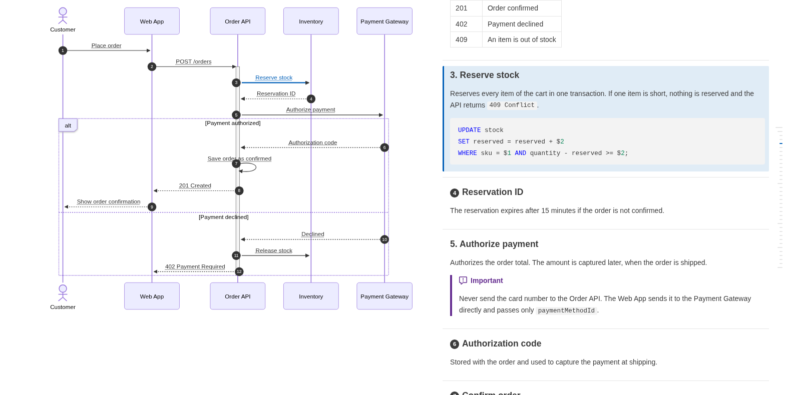
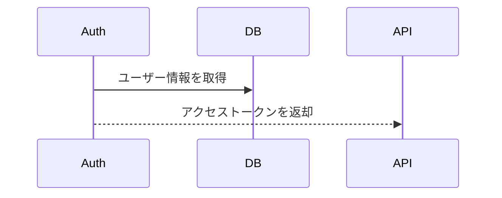

# Markdown Sequence Side Notes

[English](README.md) | 日本語

設計書としてのMarkdownを、**mermaidのシーケンス図と処理概要を横並びにして**プレビューする拡張機能です。
図の矢印と処理概要の見出しが紐付き、相互にハイライト・スクロールできます。



## 機能

- **横並び表示**: プレビューの幅が十分にあるとき、左にシーケンス図（スクロールしても固定）、右に処理概要を表示します（紐付いた項目の間には区切り線が入ります）。幅が狭いときは通常の縦並びになります。
- **矢印と見出しの紐付け**: 矢印にマウスを乗せる・クリックすると対応する処理概要がハイライトされ、見出しをクリックすると図の該当矢印へスクロールします。
- **エディタとの同期**: エディタのスクロールとカーソルにプレビューが追従します（カーソルが矢印の行にあればその矢印をハイライト）。プレビューをダブルクリックするとエディタの該当行へ移動します。
- **標準Markdownのまま**: 紐付けの記法はmermaidのコメントとHTMLコメントだけなので、GitHubや標準のMarkdownプレビューでもそのまま正しく表示されます。
- **設計書でよく使う記法**: 先頭の YAML front matter は表示せず、コードブロックはシンタックスハイライトします。GitHub のアラート（`> [!NOTE]`）とタスクリスト（`- [ ]`）も表示します。
- **幅の調整**: 左右の境界をドラッグして幅を変えられます（ダブルクリックで元に戻ります）。

## 使い方

Markdownファイルを開いてエディタのタイトルバーにあるプレビューアイコンをクリックするか、コマンドパレットから次のコマンドを実行します。

- `Markdown Sequence Side Notes: Sequence Side Notes プレビューを横に開く`
- `Markdown Sequence Side Notes: Sequence Side Notes プレビューを開く`

テキストエディタの代わりに開くこともできます。コマンド **エディターを再度開くアプリケーションの選択...**（タブ右上の「テキスト エディター」と表示されている部分）から **Sequence Side Notes プレビュー** を選んでください。Markdownファイルを常にこのプレビューで開くには、同じリストの「'*.md' の既定値を設定する」を選ぶか、設定に次を追加します。

```json
"workbench.editorAssociations": { "*.md": "seqNotes.editor", "*.markdown": "seqNotes.editor" }
```

## 書き方

````markdown
# シーケンス



# 処理概要

## ユーザー情報を取得

ID をキーにユーザーを 1 件取得する。

## トークン発行

有効期限 1 時間の JWT を発行する。

<!-- seq-notes:end -->
````

| 記法 | 意味 |
|---|---|
| `%% @seq-notes` | 必須。そのシーケンス図を処理概要と横並びで表示することを示します。mermaidブロック内のどこに書いても構いません。 |
| 矢印の文言と見出しが同じ | `Auth->>DB: ユーザー情報を取得` は見出し「ユーザー情報を取得」に自動で紐付きます。 |
| 番号付きの見出し | `## 3. ユーザー情報を取得` も「ユーザー情報を取得」に紐付きます（完全に一致する見出しがない場合、先頭の `3.`、`3)`、`(3)`、`③`、`1.2.3` などの番号を除いて比較します）。 |
| `%% @ref 見出し` | **直後の**矢印を指定した見出しに紐付けます（文言が見出しと違う場合に使用）。 |
| `<!-- seq-notes:end -->` | 任意。右カラム（処理概要）の終わりを明示します。省略時は次の `%% @seq-notes` 付きのシーケンス図または文書末尾までが右カラムになります。 |

- 紐付けの対象になるのは、シーケンス図より**後ろ**にあり、右カラムの範囲内にある見出しだけです。
- 前後の空白・連続する空白は無視して比較し、矢印の文言中の `<br/>` は空白として扱います。
- 横並びにするのは `%% @seq-notes` のあるシーケンス図だけです（紐付けが1件もなくても横並びにします）。それ以外の図は通常どおり表示し、その中の `@ref` は警告を表示します。
- リストや引用の中にあるシーケンス図では `%% @seq-notes` は効かず、警告を表示します。
- `@ref` で指定した見出しが見つからない場合は、プレビュー上部に警告を表示します。
- `autonumber` を使うと、紐付いた見出しに矢印の番号を表示します（`## 3. ユーザー情報を取得` のように見出しが同じ番号で始まる場合は表示しません）。
- 記述漏れに気付けるよう、見出しに紐付いていない矢印は文言を薄く表示します。また、紐付いた見出しと同じレベルなのに矢印がない見出しには「no arrow」の印を付けます。紐付けが1件もない図では印を付けません。

## 設定

| 設定 | 既定値 | 説明 |
|---|---|---|
| `seqNotes.splitMinWidth` | `1000` | 横並び表示にする最小のプレビュー幅 (px) |
| `seqNotes.syncEditor` | `true` | エディタとの同期、ダブルクリックでのジャンプを有効にする |
