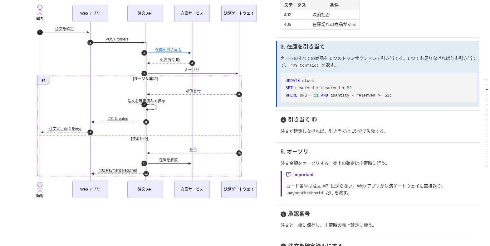
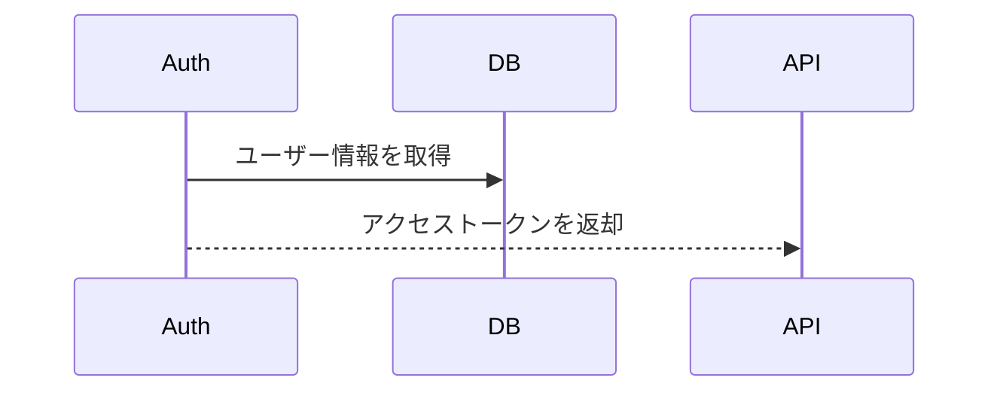
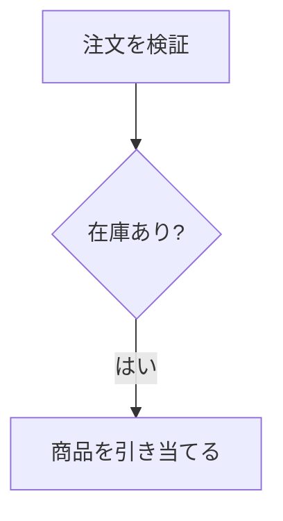

# Markdown Design Doc Viewer

[](https://github.com/playree/markdown-design-doc-viewer/actions/workflows/ci.yml)
[](https://marketplace.visualstudio.com/items?itemName=playree.markdown-design-doc-viewer)
[](https://marketplace.visualstudio.com/items?itemName=playree.markdown-design-doc-viewer)
[](LICENSE)

[English](README.md) | 日本語

設計書としてのMarkdownをプレビューする拡張機能（Markdown 設計書ビューア）です。主な機能として、**mermaidのシーケンス図やフローチャートと処理概要を横並びにして**表示します。
図の矢印（フローチャートではノード）と処理概要の見出しが紐付き、相互にハイライト・スクロールできます。



**[サンプル](https://playree.github.io/markdown-design-doc-viewer/ja/)**: 設計書（[examples/screenshot.ja.md](examples/screenshot.ja.md)）を HTML にエクスポートしたものです。矢印や見出しにマウスを載せて、ブラウザでハイライトを試せます。

## 機能

- **横並び表示**: プレビューの幅が十分にあるとき、左に図（スクロールしても固定）、右に処理概要を表示します（紐付いた項目の間には区切り線が入ります）。幅が狭いときは通常の縦並びになります。
- **矢印・ノードと見出しの紐付け**: 矢印（フローチャートではノード）にマウスを乗せる・クリックすると対応する処理概要がハイライトされ、見出しをクリックすると図の該当箇所へスクロールします。
- **エディタとの同期**: エディタのスクロールとカーソルにプレビューが追従します（カーソルが矢印やノードの行にあればそれをハイライト）。プレビューをダブルクリックするとエディタの該当行へ移動します。
- **標準Markdownのまま**: 紐付けの記法はmermaidのコメントとHTMLコメントだけなので、GitHubや標準のMarkdownプレビューでもそのまま正しく表示されます。
- **設計書でよく使う記法**: 先頭の YAML front matter はメタ情報（タイトル・版数・ステータスなど）の表として表示し（`type: design_doc` を書くとヘッダとして表示。後述）、コードブロックはシンタックスハイライトします。GitHub のアラート（`> [!NOTE]`）、タスクリスト（`- [ ]`）、脚注（`[^1]`。参照にマウスを載せると内容をポップアップ表示）も表示します。
- **表のヘッダ行の固定**: 長い表をスクロールしても、ヘッダ行をプレビューの上端に固定して表示するので、どの列か常に分かります。HTML エクスポートでも同じように動きます。`mdDesignDoc.stickyTableHeader` でオフにできます。
- **幅の調整**: 左右の境界をドラッグして幅を変えられます（ダブルクリックで元に戻ります）。プレビューの幅が広いときは本文を最大 1280px の中央のカラムに収めます。プレビューのタイトルバーのボタンで全幅表示と切り替えられます。
- **ライト・ダークの切り替え**: プレビューは既定で VS Code の配色テーマに従います。プレビューのタイトルバーのボタンで、ライトとダークのうち今と反対の配色に切り替えられます（エディタはダークのまま設計書だけライトで読む、など）。もう一度押すと VS Code の配色に従う状態に戻ります。選んだ配色は `mdDesignDoc.theme` に保存されます。
- **目次**: プレビュー右端の短い線にマウスを乗せると目次（h1〜h3）が開き、クリックでその見出しへ移動します。現在位置の線は強調表示されます。
- **図・画像の拡大**: mermaid の図にマウスを乗せると右上に出るボタンで、図を全画面で表示します。ホイールで拡大縮小、ドラッグで移動、ダブルクリックで全体表示に戻り、Esc で閉じます。紐付いた矢印をクリックすると、図を閉じて処理概要へ移動します。画像もクリックすると同じように全画面で表示します（リンクの中の画像はクリックでリンクを開きます）。
- **検索**: プレビューにフォーカスがあるときに `Ctrl+F`（macOS では `Cmd+F`）でプレビュー内を検索できます。
- **HTML エクスポート**: コマンド `Markdown 設計書ビューア: 設計書を HTML にエクスポート`（プレビューの右クリックメニューにもあります）で、設計書を 1 つの HTML ファイルに書き出します。図はライトテーマで描画済みの状態で、ローカルの画像は埋め込まれます（プレビューと同じく、文書のフォルダとワークスペース内の画像だけを埋め込み、それ以外はリンクのままにします）。ブラウザでも横並び表示と矢印・見出しのハイライトが動き、印刷すると縦並びになるので、ブラウザの印刷から PDF にできます。警告と紐付け漏れの印は書き出しません。CI やバッチ処理向けにコマンドラインからも実行できます（[コマンドライン（CI）](#コマンドラインci) を参照）。


## 使い方

Markdownファイルを開いてエディタのタイトルバーにあるプレビューアイコンをクリックするか、コマンドパレットから次のコマンドを実行します。

- `Markdown 設計書ビューア: 設計書プレビューを横に開く`
- `Markdown 設計書ビューア: 設計書プレビューを開く`

テキストエディタの代わりに開くこともできます。コマンド **エディターを再度開くアプリケーションの選択...**（タブ右上の「テキスト エディター」と表示されている部分）から **設計書プレビュー** を選んでください。Markdownファイルを常にこのプレビューで開くには、同じリストの「'*.md' の既定値を設定する」を選ぶか、設定に次を追加します。

```json
"workbench.editorAssociations": { "*.md": "mdDesignDoc.editor", "*.markdown": "mdDesignDoc.editor" }
```

## 書き方

````markdown
---
type: design_doc
title: ログイン機能 設計書
version: 1.0
product: Example
status: 作成中
updated: 2026-10-11
---

# ログイン機能 設計書

## シーケンス


```mermaid
%% @link-headings
sequenceDiagram
    Auth->>DB: ユーザー情報を取得
    %% @ref トークン発行
    Auth-->>API: アクセストークンを返却
```

## 処理概要

### ユーザー情報を取得

ID をキーにユーザーを 1 件取得する。

### トークン発行

有効期限 1 時間の JWT を発行する。

<!-- link-headings:end -->
````

| 記法 | 意味 |
|---|---|
| `%% @link-headings` | 必須。その図（シーケンス図またはフローチャート）を処理概要と紐付け、横並びで表示することを示します。mermaidブロック内のどこに書いても構いません。 |
| 矢印の文言と見出しが同じ | `Auth->>DB: ユーザー情報を取得` は見出し「ユーザー情報を取得」に自動で紐付きます。 |
| 番号付きの見出し | `### 3. ユーザー情報を取得` も「ユーザー情報を取得」に紐付きます（完全に一致する見出しがない場合、先頭の `3.`、`3)`、`(3)`、`③`、`1.2.3` などの番号を除いて比較します）。 |
| `%% @ref 見出し` | **直後の**矢印を指定した見出しに紐付けます（文言が見出しと違う場合に使用）。 |
| `<!-- link-headings:end -->` | 任意。右カラム（処理概要）の終わりを明示します。省略時は次の `%% @link-headings` 付きの図または文書末尾までが右カラムになります。 |
| front matter | 任意。`---` の行で囲んだメタ情報を先頭に表で表示します。`type: design_doc` を書くと文書のヘッダとして表示します（[設計書のヘッダ](#設計書のヘッダ)を参照）。 |

- 紐付けの対象になるのは、図より**後ろ**にあり、右カラムの範囲内にある見出しだけです。
- 前後の空白・連続する空白は無視して比較し、矢印の文言中の `<br/>` は空白として扱います。
- 横並びにするのは `%% @link-headings` のある図だけです（紐付けが1件もなくても横並びにします）。それ以外の図は通常どおり表示し、その中の `@ref` は警告を表示します。
- リストや引用の中にある図では `%% @link-headings` は効かず、警告を表示します。
- `@ref` で指定した見出しが見つからない場合は、プレビュー上部に警告を表示します。警告は × ボタンで一時的に隠せます（警告の内容が変わると再び表示します）。
- `autonumber` を使うと、紐付いた見出しに矢印の番号を表示します（`### 3. ユーザー情報を取得` のように見出しが同じ番号で始まる場合は表示しません）。`mdDesignDoc.headingNumbers` をオフにすると表示しません。
- 記述漏れに気付けるよう、見出しに紐付いていない矢印は文言を薄く表示します。また、紐付いた見出しと同じレベルなのに矢印がない見出しには「矢印なし」の印を付けます。紐付けが1件もない図では印を付けません。
- 同じ警告と紐付け漏れは、開いている Markdown ファイルについて「問題」パネルにも表示します（プレビューを開いていなくても表示します）。`%% @link-headings` があるのに紐付けが1件もない図も、こちらには表示します。
- エディタでは、`%% @ref ` の後ろで処理概要の見出しを補完します（まだ紐付いていない見出しが先に出ます）。紐付け漏れの診断には、電球（`Ctrl+.`）から次のクイックフィックスを使えます: `@ref` を書いて紐付いていない見出しへ紐付ける、矢印と同じ文言の見出しを処理概要に追加する、見つからない `@ref` を既存の見出しに直す。
- 警告・印・ツールチップは VS Code の表示言語に合わせて日本語または英語で表示します。


### フローチャート

フローチャート（`graph` / `flowchart`）も同じように紐付けられます。矢印の代わりに**ノード**が見出しと紐付きます。

````markdown

```mermaid
%% @link-headings
flowchart TD
    A[注文を検証] --> B{在庫あり?}
    %% @ref 在庫を確保
    B -->|はい| C[商品を引き当てる]
```

## 注文を検証

## 在庫あり?

## 在庫を確保
````


- ノードはラベルと同じ文言の見出しに紐付きます（`A[注文を検証]` → 「注文を検証」）。ラベルのないノード（`A`）は ID を文言として扱い、見出しがなくても紐付け漏れとして扱いません。エッジのラベルは紐付けの対象外です。
- `%% @ref 見出し` は、直後の行で定義したノードを紐付けます。その行でラベルを書いた最初のノード、なければその行で初めて登場した最初のノード、それもなければその行の最初のノードです。
- 横向き（`LR` / `RL`）のフローチャートは幅が広く処理概要と横に並べられないため、常に処理概要を図の下に表示します。紐付けは同じように動きます。
- 見出しに紐付いていないノードは文言を薄く表示し、ノードのない処理の見出しには「ノードなし」の印を付けます。
- フローチャートには `autonumber` がないため、見出しに番号は表示しません。

## 設計書のヘッダ

設計書では、YAML front matter に `type: design_doc` を書くことをおすすめします。主なメタ情報を表ではなく文書のヘッダとして表示します。

```markdown
---
type: design_doc
title: 注文確定 設計書
version: 2.1
product: Example
status: レビュー中
updated: 2026-10-01
owner: commerce-team
reviewers:
  - payments-team
  - inventory-team
---

# 注文確定 設計書
```


- ヘッダは枠で囲み、左に `title` を太字で、右に `version`（版数）・`product`（プロダクト）・`status`（ステータス）・`updated`（更新日）を縦線で区切って並べます（この順で、書かれていないものは省きます）。
- それ以外のキー（この例では `owner` と `reviewers`）は、ヘッダの下の折りたたみ（既定で閉じた状態）に表で表示します。`type` 自体は表示しません。

## AI で設計書を書く

AI アシスタント（Claude Code、GitHub Copilot、Cursor など）にこの形式で設計書を書かせるには、[AI 向けの記法ガイド](docs/ai-authoring-guide.ja.md)（[English](docs/ai-authoring-guide.md)）を渡してください。プロジェクトの指示ファイル（`CLAUDE.md`、`AGENTS.md`、`.github/copilot-instructions.md` など）にコピーするか、AI に読ませます。

ガイドは[コマンドライン](#コマンドラインci)の使い方とあわせて [Agent Skill](https://agentskills.io/) にもしてあります。[markdown-design-doc-skill.zip](https://github.com/playree/markdown-design-doc-viewer/releases/latest/download/markdown-design-doc-skill.zip) をダウンロードし、Claude（claude.ai）ではスキルの設定からアップロード、Claude Code では `~/.claude/skills/` かプロジェクトの `.claude/skills/` に展開します（Agent Skills に対応したほかの AI アシスタントでは、そのスキルのフォルダに展開します）。指示ファイルにガイドをコピーしなくても、設計書を書くよう頼むと AI がこれを使います。Skill は英語で書いてありますが、設計書は依頼の言語で書きます。

ガイドでは、ファイルの診断を確認するよう AI に指示しています。VS Code の診断を読めるエージェント（Copilot のエージェントモードや、VS Code に接続した Claude Code など）は、紐付いていない矢印や見出しを自分で見つけて直せます。

## デスクトップアプリ

プレビューは Windows・macOS・Linux のデスクトップアプリとしても使え、VS Code がなくても設計書を読めます。表示は拡張機能のプレビューと同じで、ファイルを保存すると表示を更新します。インストーラは[最新のリリース](https://github.com/playree/markdown-design-doc-viewer/releases/latest)からダウンロードしてください。

インストーラにはまだ署名がありません。初回起動時の OS の警告への対処と使い方は [デスクトップアプリの説明](docs/desktop.ja.md) を参照してください。

## コマンドライン（CI）

HTML エクスポートはコマンドラインからも実行でき、CI やバッチ処理で VS Code なしに設計書を変換できます。`Export Design Doc as HTML` コマンドと同じ HTML ファイルを書き出します（図はプレビューをヘッドレス Chrome で動かして描画します）。Node.js 22 以降と、Chrome か Chromium が必要です。

```sh
npx markdown-design-doc-viewer export docs -o site     # docs/ 以下の Markdown をすべて site/docs/*.html に
```

オプションや GitHub Actions での例は [コマンドラインの README](docs/cli.ja.md) を参照してください。

## 設定

| 設定 | 既定値 | 説明 |
|---|---|---|
| `mdDesignDoc.splitMinWidth` | `1000` | 横並び表示にする最小のプレビュー幅 (px) |
| `mdDesignDoc.limitContentWidth` | `true` | プレビューの幅が広いとき、本文を最大 1280px の中央のカラムに収める（横並びの図は全幅のまま）。プレビューのタイトルバーのボタンでも切り替えられ、HTML エクスポートにも適用される |
| `mdDesignDoc.stickyTableHeader` | `true` | 長い表をスクロールしても、ヘッダ行を上端に固定して表示する（プレビューと HTML エクスポート） |
| `mdDesignDoc.syncEditor` | `true` | エディタとの同期、ダブルクリックでのジャンプを有効にする |
| `mdDesignDoc.toc` | `true` | プレビュー右端に目次を表示する |
| `mdDesignDoc.headingNumbers` | `true` | `autonumber` を使ったとき、紐付いた見出しの先頭に矢印の番号を表示する（プレビューと HTML エクスポート） |
| `mdDesignDoc.diagramLook` | `neo` | mermaid の図の見た目。`neo`（mermaid の標準。フローチャートのノードに影が付く）または `classic`（影のない平坦な見た目）。図の front matter に `config: look:` を書いた図はその指定に従う |
| `mdDesignDoc.theme` | `auto` | プレビューの配色。`auto`（VS Code に従う）、`light`、`dark` のいずれか。プレビューのタイトルバーのボタンでも切り替えられる。HTML エクスポートは常にライト |
| `mdDesignDoc.frontMatter` | `true` | 先頭の YAML front matter をメタ情報の表（`type: design_doc` ではヘッダ）として表示する（オフにすると表示しない） |
| `mdDesignDoc.diagnostics` | `true` | 開いている Markdown ファイルの紐付けの警告と漏れを「問題」パネルに表示する |
