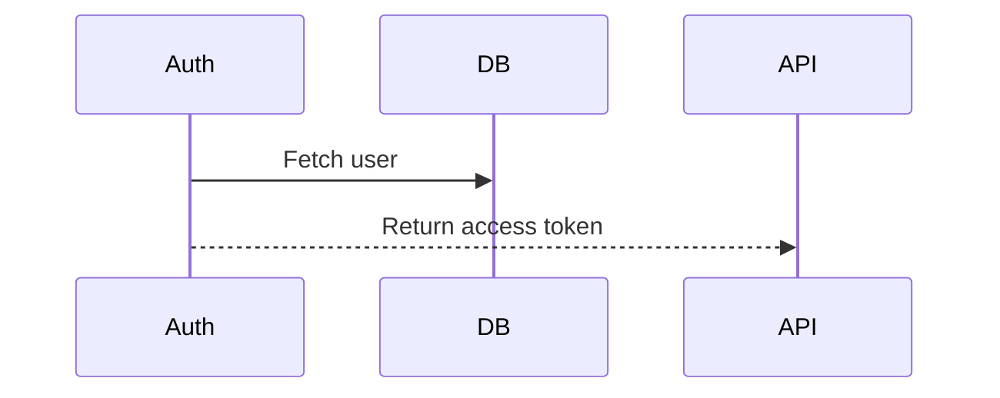

# Markdown Design Doc Viewer

English | [日本語](README.ja.md)

A viewer for design documents written in Markdown. Its main feature shows **mermaid sequence diagrams side by side with their step descriptions**.
Each arrow in the diagram is linked to a heading in the description, so you can jump back and forth between them.


## Features

- **Side-by-side layout** — when the preview is wide enough, the sequence diagram stays on the left (sticky) while the descriptions scroll on the right, with a line between linked steps. On narrow panes it falls back to the normal vertical layout.
- **Arrow ⇔ heading links** — hover or click an arrow to highlight its description, or click a heading to find its arrow in the diagram.
- **Editor sync** — the preview follows the editor's scroll position and cursor (an arrow is highlighted when the cursor is on its line). Double-click in the preview to jump to the source line.
- **Plain Markdown** — the link syntax is made of mermaid comments and HTML comments, so the same file still renders correctly on GitHub and in the built-in Markdown preview.
- **Design document friendly** — YAML front matter is shown as a table of the document's metadata (title, version, status...), code blocks are syntax highlighted, and GitHub alerts (`> [!NOTE]`) and task lists (`- [ ]`) are rendered.
- **Resizable** — drag the boundary between the columns to resize them; double-click it to reset.
- **Table of contents** — hover the short lines at the right edge of the preview to open a table of contents (h1–h3) and jump to a heading. The highlighted line shows where you are.
- **Diagram zoom** — hover a mermaid diagram and click the button at its top right to show it full screen. Scroll the wheel to zoom, drag to pan, double-click to fit it again and press Esc to close. Clicking a linked arrow closes it and shows the step.
- **Find** — press `Ctrl+F` (`Cmd+F` on macOS) in the preview to search it.

## Usage

Open a Markdown file and click the preview icon in the editor title bar, or run one of these commands from the Command Palette:

- `Markdown Design Doc Viewer: Open Design Doc Preview to the Side`
- `Markdown Design Doc Viewer: Open Design Doc Preview`

It can also be opened in place of the text editor: choose **Design Doc Preview** from **Reopen Editor With...** (the editor picker at the top right of the tab bar). To always open Markdown files with it, pick "Configure default editor for '*.md'" in that list, or add this to your settings:

```json
"workbench.editorAssociations": { "*.md": "mdDesignDoc.editor", "*.markdown": "mdDesignDoc.editor" }
```

## Writing linked documents

````markdown
# Sequence



# Steps

## Fetch user

Look up the user by id.

## Issue token

Issue a JWT valid for one hour.

<!-- seq-notes:end -->
````

| Syntax | Meaning |
|---|---|
| `%% @seq-notes` | Required. Marks the sequence diagram to be shown side by side with its descriptions. Write it anywhere inside the mermaid block. |
| Arrow label equals a heading | `Auth->>DB: Fetch user` links to the heading `Fetch user` automatically. |
| Numbered heading | `## 3. Fetch user` also links to `Fetch user` (`3.`, `3)`, `(3)`, `③`, `1.2.3` and similar prefixes are ignored when no heading matches exactly). |
| `%% @ref <heading>` | Links the **next** arrow to `<heading>` when its label differs from the heading. |
| `<!-- seq-notes:end -->` | Optional. Ends the description column. Without it, the column extends to the next `%% @seq-notes` diagram or the end of the document. |

Rules:

- Only headings **after** the diagram (up to the end of the description column) are linked.
- Labels and headings are compared after trimming and collapsing whitespace; `<br/>` in a label counts as a space.
- Only diagrams with `%% @seq-notes` are shown side by side (even if no arrow is linked). Other diagrams are rendered normally, and an `@ref` in them is reported as a warning.
- `%% @seq-notes` has no effect on a diagram inside a list or blockquote; this is reported as a warning.
- An `@ref` whose heading cannot be found is reported as a warning at the top of the preview. The × button hides the warnings temporarily; they are shown again when they change.
- With `autonumber`, linked headings show the arrow's number, unless the heading already starts with it (`## 3. Fetch user`).
- To help spot missing descriptions, arrows without a linked heading are shown faded, and headings at the same level as the linked ones but without an arrow get a "no arrow" mark. Diagrams with no links at all get no marks.
- The same warnings and missing links are also reported in the Problems panel for open Markdown files, even when no preview is open. A diagram with `%% @seq-notes` but no links at all is reported there too.
- In the editor, the headings of the overview are completed after `%% @ref ` (those without an arrow first). The missing-link diagnostics come with quick fixes (light bulb, `Ctrl+.`): link the arrow to a heading without an arrow by writing a `@ref`, add a heading with the arrow's text to the overview, or point a broken `@ref` to an existing heading.
- Warnings, marks and tooltips are shown in English or Japanese, following the VS Code display language.

## Writing with AI

To have an AI assistant (Claude Code, GitHub Copilot, Cursor and so on) write documents in this format, give it the [authoring guide for AI](docs/ai-authoring-guide.md) ([日本語](docs/ai-authoring-guide.ja.md)). Copy it into your project's instructions file (`CLAUDE.md`, `AGENTS.md`, `.github/copilot-instructions.md` and so on), or tell the assistant to read it.

The guide also tells the assistant to read the diagnostics of the file. Agents that can read VS Code diagnostics (for example Copilot agent mode, or Claude Code connected to VS Code) can then find and fix arrows and headings that are not linked.

## Settings

| Setting | Default | Description |
|---|---|---|
| `mdDesignDoc.splitMinWidth` | `1000` | Minimum preview width (px) for the side-by-side layout. |
| `mdDesignDoc.syncEditor` | `true` | Sync the preview with the editor and enable double-click to jump to the source. |
| `mdDesignDoc.toc` | `true` | Show the table of contents at the right edge of the preview. |
| `mdDesignDoc.frontMatter` | `true` | Show the YAML front matter at the top as a table of metadata. When off, it is hidden. |
| `mdDesignDoc.diagnostics` | `true` | Report link warnings and missing links of open Markdown files in the Problems panel. |
