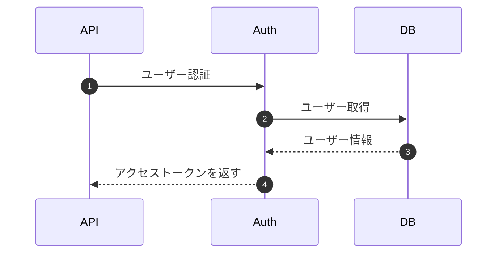

# Markdown 設計書ビューア向けの設計書の書き方

[English](ai-authoring-guide.md) | 日本語

設計書を Markdown で書くときは、次の規則に従ってください。設計書は VS Code 拡張「Markdown 設計書ビューア」でプレビューします。プレビューでは、mermaid のシーケンス図を左に、その後ろの処理概要を右に並べ、図の矢印を同じ文言の見出しに紐付けます。すべての矢印が見出しに紐付き、処理概要のすべての見出しが矢印に紐付いている状態を目指してください。

## テンプレート

````markdown
## シーケンス



## 処理概要

### 1. ユーザー認証

処理内容、入力、入力チェック、エラー。

### 2. ユーザー取得

検索条件と、認証に失敗する条件。

### 3. ユーザー情報

返す列。

### 4. トークン発行

トークンのクレームと有効期限。

<!-- seq-notes:end -->

## 次の節
````

## シーケンス図

- 処理の流れは、`sequenceDiagram` で始まる ` ```mermaid ` ブロック 1 つに書く。
- ブロックの中に `%% @seq-notes` を独立した行で書く。これがないと横並びにならず、何も紐付かない。
- 図は文書のトップレベルに置く。リストや引用の中には置かない。
- 矢印の文言（`:` の後ろ）は短くし、図の中で重複させない。この文言が処理概要の見出しになる。
- `autonumber` は使ってよい。プレビューでは、矢印の番号が見出しの横に表示される。
- ほかの mermaid の図（フローチャート、ER 図、`%% @seq-notes` のないシーケンス図）は通常どおり表示される。その中には `%% @ref` を書かない。

## 処理概要

- 処理概要は図の **後ろ** に、矢印の順に、矢印 1 本につき見出し 1 つで書く。
- 処理の見出しのレベルはすべてそろえる。通常は、図を含む節の見出しより 1 つ下のレベルにする。
- 見出しの文言は矢印の文言と同じにする。前後の空白と連続する空白は無視して比較し、矢印の文言中の `<br/>` は空白として扱う。
- 見出しの先頭には番号を付けてよい。`### 3. ユーザー取得` は矢印「ユーザー取得」に紐付く。番号を付けるなら `autonumber` の番号と合わせる。
- 見出しを矢印の文言と変えたいときは、図の中で、その矢印の直前の行に `%% @ref <見出しの文言>` を書く。この方法で、複数の矢印（要求と応答など）を同じ見出しに紐付けてもよい。
- 処理と同じレベルに、どの矢印とも紐付かない見出しを作らない。「矢印なし」の印が付く。補足は段落、1 つ下のレベルの見出し、または終わりのマーカーの後ろに書く。
- リストや引用の中の見出しは処理として扱われない。
- 最後の処理の後ろに、`<!-- seq-notes:end -->` をトップレベルの独立した行で書く。これがないと、次の `%% @seq-notes` 付きの図か文書の末尾までが処理概要になる。

## その他の Markdown

- 先頭に YAML front matter を書いてよい（プレビューには表示されない）。1 行目は `key: value` の形にする。
- 表、言語を指定したコードブロック（` ```json `、` ```sql `）、GitHub のアラート（`> [!NOTE]`、`> [!TIP]`、`> [!IMPORTANT]`、`> [!WARNING]`、`> [!CAUTION]`）、タスクリスト（`- [ ]`、`- [x]`）が表示される。

## 確認

ファイルを VS Code で開いていると、拡張機能が紐付けの問題を、ソースが `Markdown Design Doc` の診断として報告する。報告されるのは、見出しのない矢印、矢印のない処理の見出し、存在しない `@ref` の見出し、効いていない `%% @seq-notes` である。設計書を書いたり直したりした後は、そのファイルの診断を読み、診断がなくなるまで設計書を直すこと。
