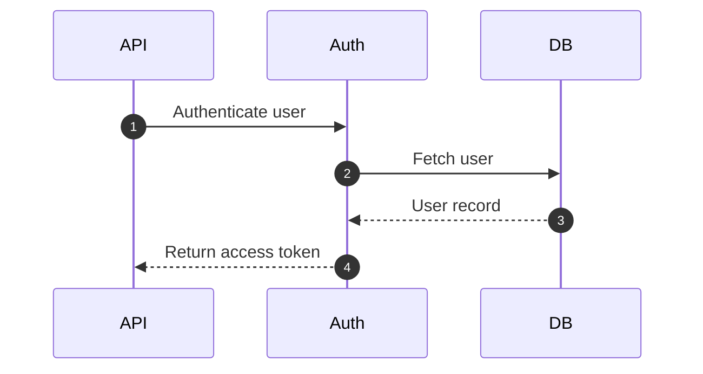

# Writing design documents for Markdown Design Doc Viewer

English | [日本語](ai-authoring-guide.ja.md)

Follow these rules when you write a design document in Markdown. The document is previewed with the VS Code extension "Markdown Design Doc Viewer". The preview shows a mermaid sequence diagram (or flowchart) on the left and the step descriptions after it on the right. Each arrow of the diagram (each node of a flowchart) is linked to the heading with the same text. The goal is that every arrow is linked to a heading and every step heading is linked to an arrow.

## Template

````markdown
---
type: design_doc
title: Login Feature Design
version: 1.0
product: <product name>
status: draft
updated: 2026-10-10
---

# Login Feature Design

## Sequence



## Steps

### 1. Authenticate user

What happens, inputs, validation, errors.

### 2. Fetch user

The query and the conditions under which authentication fails.

### 3. User record

The columns returned.

### 4. Issue token

The token's claims and expiry.

<!-- link-headings:end -->

## Next section
````

## Sequence diagram

- Write the flow as one ` ```mermaid ` block that starts with `sequenceDiagram`.
- Put `%% @link-headings` on a line of its own inside the block. Without it, the diagram is not shown side by side and nothing is linked.
- Put the diagram at the top level of the document, not inside a list or blockquote.
- Keep each arrow label (the text after `:`) short and unique within the diagram. It becomes the step heading.
- `autonumber` may be used. The preview then shows the arrow's number next to its heading (unless `mdDesignDoc.headingNumbers` is off).
- Other mermaid diagrams (ER diagrams, diagrams without `%% @link-headings`) are rendered normally. Do not put `%% @ref` in them.

## Flowchart

A flowchart (`flowchart TD` / `graph TD`) can be linked instead of a sequence diagram, with its nodes in place of the arrows. The rules of the step descriptions apply with "node" for "arrow".

- Put `%% @link-headings` on a line of its own inside the block, as for a sequence diagram.
- Give every step node a short label that is unique within the diagram (`A[Validate order]`). The label becomes the step heading. Nodes without a label are not steps.
- Define each step node with its label on a line of its own before writing the edges, so that a `%% @ref <heading text>` on the line just before it applies to that node.
- Use `TD` (top to bottom) for flows with step descriptions. `LR` / `RL` flowcharts are shown above their steps, not beside them.
- Edge labels (`-->|Yes|`) are not linked to headings.

## Step descriptions

- Write the descriptions **after** the diagram, as headings in the order of the arrows, one heading per arrow.
- Use the same heading level for all steps, usually one level below the heading of the section that holds the diagram.
- Make the heading text equal to the arrow label. Whitespace is trimmed and collapsed before comparing, and `<br/>` in a label counts as a space.
- A heading may start with a step number: `### 3. Fetch user` links to the arrow `Fetch user`. If you number the headings, use the arrow numbers given by `autonumber`.
- When the heading has to differ from the arrow label, write `%% @ref <heading text>` on the line just before the arrow, inside the diagram. Several arrows (for example a request and its response) may be linked to the same heading this way.
- Do not add headings at the step level that no arrow links to. They are marked "no arrow" ("no node" for a flowchart). Write extra notes as paragraphs, as lower-level headings, or after the end marker.
- Headings inside lists or blockquotes are not steps.
- After the last step, write `<!-- link-headings:end -->` on a line of its own at the top level. Without it, the description column extends to the next diagram with `%% @link-headings` or to the end of the document.

## Front matter

- Start the design document with YAML front matter that contains `type: design_doc`. The first line of the document is `---`, the metadata follows as `key: value` lines, and a `---` line closes it (the line right after the opening `---` must be a `key: value` line, or the block is not treated as front matter).
- `title`, `version`, `product`, `status` and `updated` are shown in a row as the document's header. Other keys are shown in a table folded below the header (closed by default).
- Also write a `#` heading with the same text as `title` at the start of the body.

## Other Markdown

- Tables, code blocks with a language (` ```json `, ` ```sql `), GitHub alerts (`> [!NOTE]`, `> [!TIP]`, `> [!IMPORTANT]`, `> [!WARNING]`, `> [!CAUTION]`) and task lists (`- [ ]`, `- [x]`) are rendered.

## Check

When the file is open in VS Code, the extension reports link problems as diagnostics with the source `Markdown Design Doc`: arrows (nodes) without a heading, step headings without an arrow (node), `@ref` targets that do not exist, and `%% @link-headings` markers that have no effect. After writing or editing the document, read the diagnostics of the file and fix the document until none of them remain.
