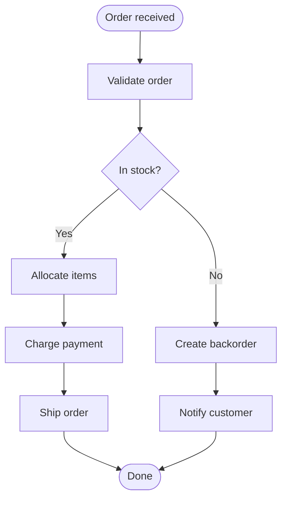
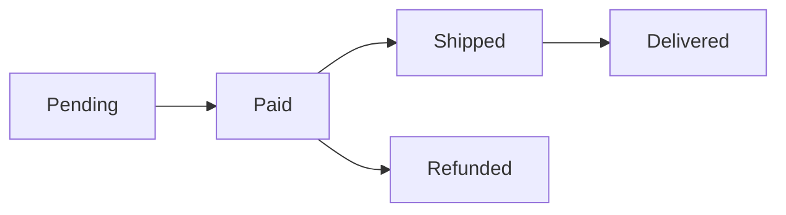

# Order Processing Design

Flowcharts are linked to their step headings like sequence diagrams: each node is linked to the heading with the same text as its label.

## Flow

## Steps

### Order received

An order arrives from the storefront or the partner API. Both are normalized to the same order record.

### Validate order

- All items exist and are on sale.
- The shipping address can be delivered to.
- The total matches the prices at the time of the order.

Invalid orders are rejected with the reason; nothing is reserved.

### In stock?

Checks the available quantity of every item in the warehouse closest to the shipping address.

### Reserve stock

Linked to the node "Allocate items" by `%% @ref`. The items are reserved for 30 minutes, so that two orders cannot take the last item.

### Create backorder

The order is kept with the status `backordered` and is retried when the items arrive.

### Charge payment

Captures the payment authorized at checkout. If the capture fails, the reservation is released.

### Ship order

Creates the shipping label and hands the order to the carrier.

### Notify customer

Sends an email with the expected arrival date of the missing items.

### Done

The order is closed and appears in the order history.

<!-- link-headings:end -->

## Status Transitions

A horizontal flowchart (`LR` or `RL`) is too wide to put beside its steps, so its steps are always shown below it. The links still work.

### Pending

The order is created and waits for payment.

### Paid

The payment was captured.

### Shipped

The carrier has the parcel. The tracking number is shown in the order history.

### Delivered

The carrier reported the delivery.

### Cancelled

No node is linked to this heading, so the preview marks it.
