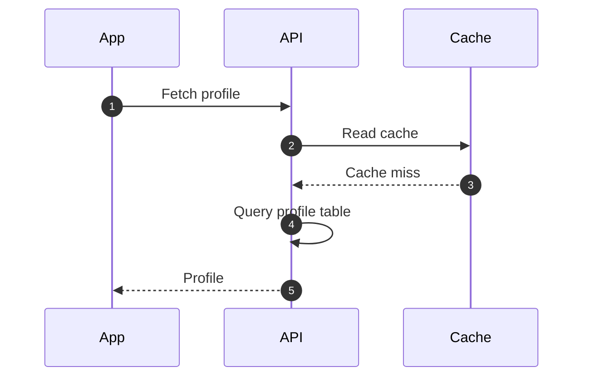
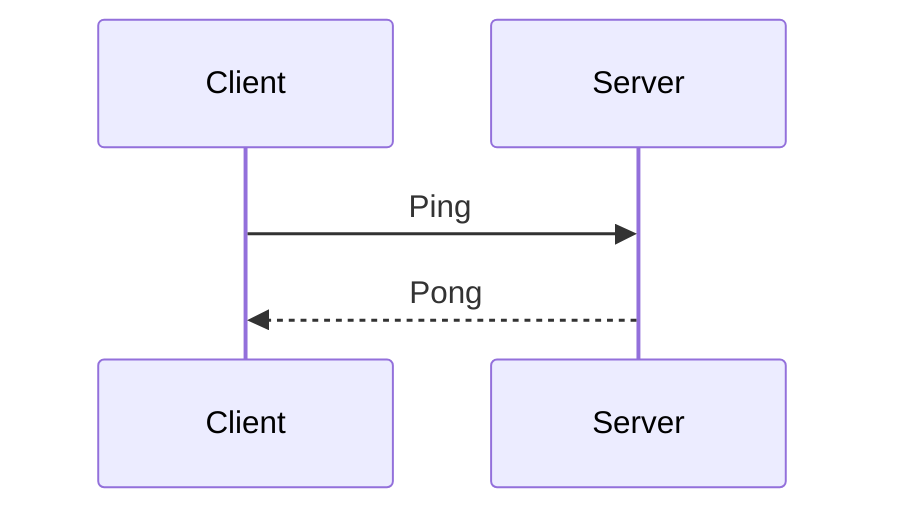
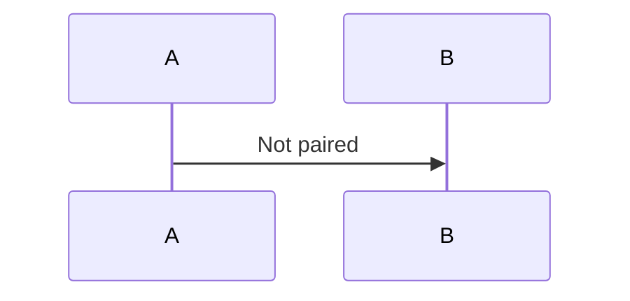

# Link Checks

This file has deliberate mistakes, to show how the preview reports arrows and headings that do not match. The same problems are listed in the Problems panel.

## Diagram with mistakes



### 1. Fetch profile

Linked, and the number matches the arrow, so no extra number is shown.

### 3. Read cache

Linked to arrow 2. The number in the heading is different, so the arrow's number is shown next to it as well.

### Profile

Linked to arrow 5. The heading has no number, so the arrow's number is shown next to it.

### Retry policy

No arrow is linked to this heading, so it gets a "no arrow" mark.

Arrow 3 (`Cache miss`) has no heading, and the `@ref` of arrow 4 points to a heading that does not exist, which is reported as a warning. Both arrows are shown faded.

<!-- seq-notes:end -->

## Diagram without links



### Health check

No arrow of this diagram is linked, so nothing is faded or marked in the preview. The Problems panel reports it once, at the diagram.

<!-- seq-notes:end -->

## Other warnings

- `%% @seq-notes` has no effect inside a list:

  ```mermaid
  %% @seq-notes
  sequenceDiagram
      A->>B: Inside a list
  ```

A diagram without `%% @seq-notes` is not paired, so its `@ref` is reported:


