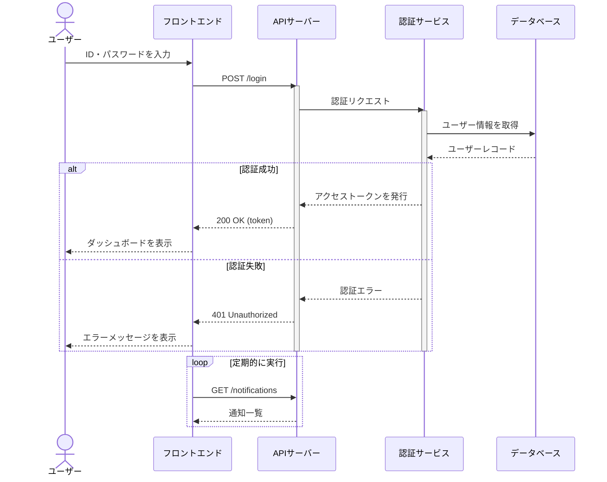
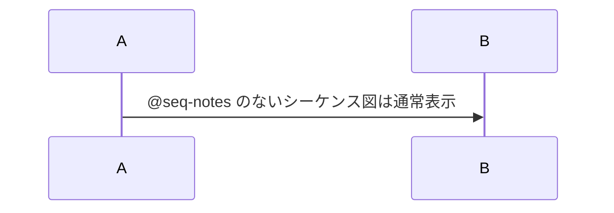

# ログイン機能 設計書

## シーケンス

## 処理概要

### POST /login

リクエストボディの `id` と `password` を検証し、認証サービスへ転送する。

| 項目 | 型 | 必須 |
|---|---|---|
| id | string | ○ |
| password | string | ○ |

### ユーザー情報を取得

`users` テーブルから `id` をキーに 1 件取得する。

- 存在しない場合は認証失敗とする
- ロック中のユーザーは認証失敗とする

### トークン発行

有効期限 1 時間の JWT を発行する。

### 認証エラー

失敗回数をインクリメントし、5 回連続で失敗した場合はユーザーをロックする。

### GET /notifications

30 秒間隔でポーリングする。

<!-- seq-notes:end -->

## 補足（横並びの対象外）

