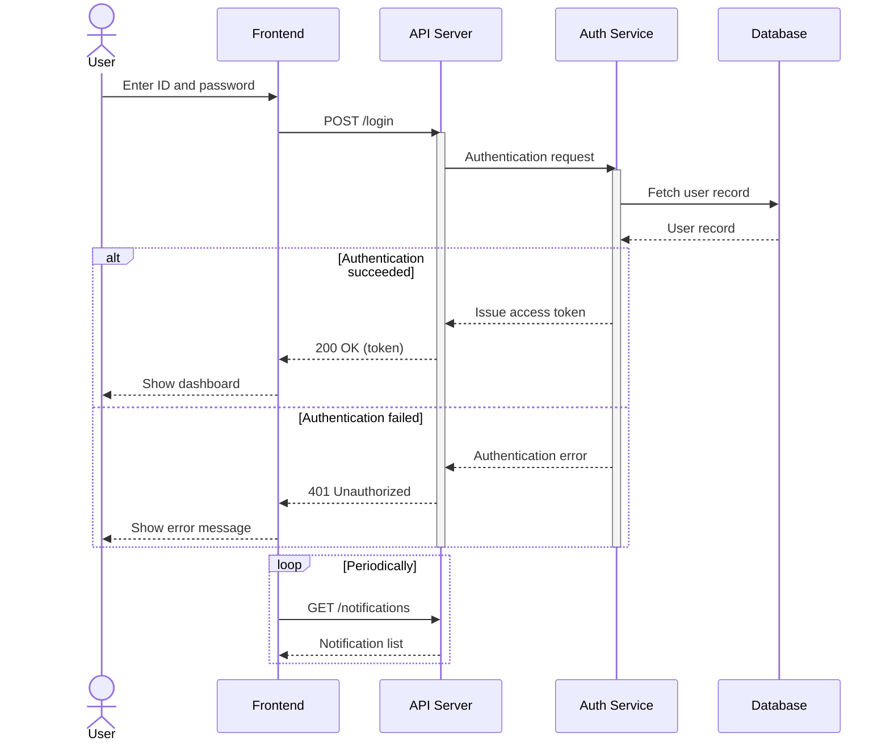
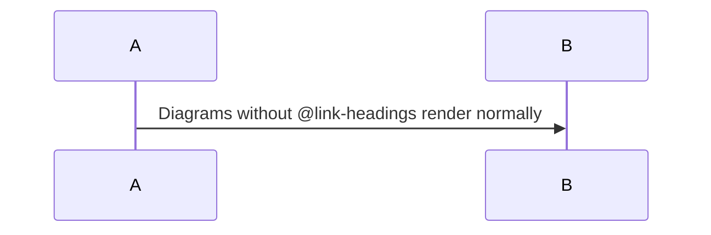

# Login Feature Design

## Sequence



## Overview

### Enter ID and password

The login form validates input on the client before sending anything to the server.
Client-side checks are for usability only; the server repeats every check.

| Field | Rule | Message |
|---|---|---|
| id | Required, 3–64 characters | "Enter your ID." |
| password | Required, 8–128 characters | "Enter your password." |

- The submit button is disabled while a request is in flight to prevent double submission.
- Leading and trailing whitespace in `id` is trimmed. `password` is sent as typed.
- The "Show password" toggle only changes the input type and never logs the value.

### POST /login

Validates `id` and `password` in the request body and forwards them to the Auth Service.

| Field | Type | Required |
|---|---|---|
| id | string | Yes |
| password | string | Yes |

Example request:

```json
{
  "id": "alice",
  "password": "correct horse battery staple"
}
```

- Requests with a malformed body return `400 Bad Request` without calling the Auth Service.
- Rate limit: 10 requests per minute per IP address. Excess requests return `429 Too Many Requests` with a `Retry-After` header.
- The request is logged with `id` and the client IP only. The password is never logged.

### Authentication request

The API Server calls the Auth Service over the internal network.

- Endpoint: `POST /internal/authenticate`
- Timeout: 3 seconds
- Retries: none, because a retried request could count one failure twice
- If the Auth Service is unreachable, the API Server returns `503 Service Unavailable`.

The API Server forwards the client IP in `X-Forwarded-For` so the Auth Service can record it in the audit log.

### Fetch user record

Fetches a single row from the `users` table using `id` as the key.

```sql
SELECT user_id, password_hash, failed_count, locked_until
FROM users
WHERE login_id = $1;
```

Authentication fails when:

- No user matches the ID
- The user is locked (`locked_until` is in the future)
- The password does not match `password_hash` (bcrypt, cost 12)

> [!IMPORTANT]
> If no user matches, the Auth Service still runs a bcrypt comparison against a dummy hash so that response times do not reveal whether the ID exists.

### Token issuance

Issues a JWT that is valid for one hour.

| Claim | Value |
|---|---|
| sub | `user_id` |
| iat | Issue time |
| exp | Issue time + 1 hour |
| scope | Roles assigned to the user |

- Signed with RS256. The public key is published at `/.well-known/jwks.json`.
- A refresh token valid for 14 days is issued alongside it and stored hashed in the `refresh_tokens` table.
- `failed_count` is reset to 0 on success.

### Show dashboard

The frontend stores the access token in memory and the refresh token in an `HttpOnly`, `Secure`, `SameSite=Strict` cookie.

- After login, the user is redirected to the page they originally requested, or to `/dashboard` if there is none.
- Five minutes before the access token expires, the frontend refreshes it in the background.

### Authentication error

Increments the failure count. After five consecutive failures, the user is locked.

| Consecutive failures | Action |
|---|---|
| 1–4 | Increment `failed_count` |
| 5 | Set `locked_until` to now + 30 minutes |

- The lock is released automatically when `locked_until` passes, or manually by an administrator.
- Each failure is written to the audit log with the time, `id`, and client IP.

### 401 Unauthorized

Every authentication failure returns the same response, whatever the cause.

```json
{
  "error": "invalid_credentials",
  "message": "The ID or password is incorrect."
}
```

Locked users receive the same response, so an attacker cannot tell which IDs exist or are locked.

### Show error message

The frontend shows the message under the form and clears the password field.

- The ID field keeps its value so the user can retry quickly.
- On `429`, the message tells the user to wait and disables the button until `Retry-After` has passed.
- On `503`, the message asks the user to try again later.

### GET /notifications

Polls every 30 seconds while the tab is visible.

- Polling pauses while the tab is hidden and resumes immediately when it becomes visible again.
- On error, the interval doubles up to a maximum of 5 minutes, and returns to 30 seconds after a successful response.
- On `401`, polling stops and the user is sent back to the login page.

Example response:

```json
{
  "items": [
    { "id": 42, "title": "Password will expire in 7 days", "read": false }
  ]
}
```

<!-- link-headings:end -->

## Appendix (not paired)


