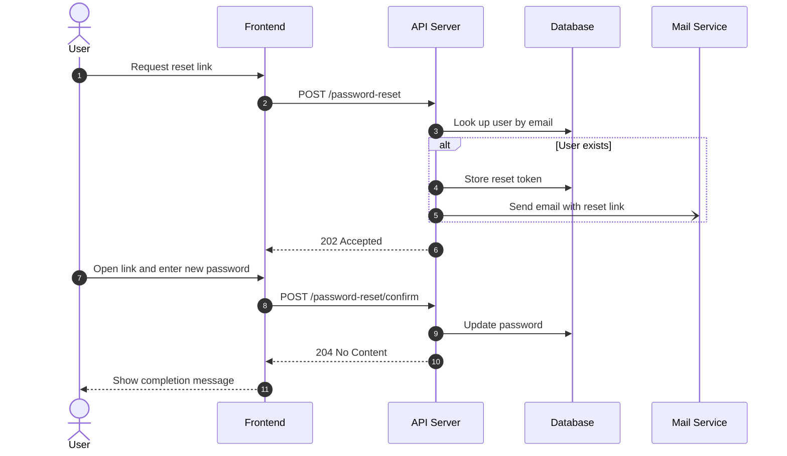

# Password Reset Design

> [!NOTE]
> This document covers the reset flow started from the "Forgot password?" link. Changing the password while logged in is described in a separate document.

## Sequence



## Overview

### 1. Request reset link

The user enters their email address on the "Forgot password?" page.

- The email field is required and must look like an email address.
- After submitting, the page always shows "If the address is registered, we sent you an email." whatever the result.

### 2. POST /password-reset

```http
POST /password-reset HTTP/1.1
Content-Type: application/json

{ "email": "alice@example.com" }
```

- Rate limit: 3 requests per hour per email address and 20 per hour per IP address.
- Requests over the limit still return `202 Accepted` but do nothing.

### 3. Look up user by email

```sql
SELECT user_id, status
FROM users
WHERE lower(email) = lower($1);
```

The lookup ignores case. Users with `status = 'disabled'` are treated as not found.

<details>
<summary>Why not a case-insensitive column?</summary>

Changing the column type to `citext` was considered, but:

- **Every** query on `email` would change behaviour, not only this one.
- An index on `lower(email)` already exists for the login form.

</details>

### Store reset token

Generates a random token and stores only its hash, so a leaked table cannot be used to reset passwords.

```typescript
import { createHash, randomBytes } from 'node:crypto';

export function createResetToken(): { token: string; hash: string } {
  const token = randomBytes(32).toString('base64url');
  const hash = createHash('sha256').update(token).digest('hex');
  return { token, hash };
}
```

| Column | Value |
|---|---|
| user_id | The user |
| token_hash | SHA-256 of the token |
| expires_at | Now + 30 minutes |
| used_at | `NULL` |

Creating a new token invalidates the user's earlier unused tokens.

### Send reset email

Queues an email with the link `https://example.com/reset?token=<token>`. The Mail Service sends it after the response has been returned, so the request does not wait for it.

```yaml
# config/mail.yaml
templates:
  password_reset:
    subject: Reset your password
    expires_in_minutes: 30
```

> [!TIP]
> To check the email locally, run the mail catcher and open http://localhost:8025.
>
> ```bash
> docker compose up -d mailpit
> ```

### 202 Accepted

The response is the same whether or not the user exists, so the endpoint cannot be used to find registered addresses.

> [!IMPORTANT]
> Do not return `404` for unknown addresses, and do not make the response noticeably slower when an email is sent. Send the email asynchronously.

### Open link and enter new password

The frontend reads the token from the URL and removes it from the address bar with `history.replaceState` so that it is not left in the browser history.

This does not remove the token from logs of the first request, so:

- The load balancer and reverse proxies must not log the query string of `/reset`.
- The page is served with `Referrer-Policy: no-referrer`, so the token is not sent to other sites in the `Referer` header.

- The new password must be 8–128 characters and must not be the same as the current one.
- If the token is expired or already used, the page shows "This link has expired." and a link to request a new one.

### 8. POST /password-reset/confirm

```json
{
  "token": "<token from the email link>",
  "password": "new correct horse battery staple"
}
```

| Status | When |
|---|---|
| 204 | Password updated |
| 400 | Password does not meet the rules |
| 410 | Token expired or already used |

### 9. Update password

Updates `password_hash` and marks the token as used in one transaction.
The token is consumed with a conditional update, so that two concurrent requests with the same token cannot both succeed:

```sql
UPDATE password_reset_tokens
SET used_at = now()
WHERE token_hash = $1 AND used_at IS NULL AND expires_at > now()
RETURNING user_id;
```

The password is updated only when this returns exactly one row; otherwise the API returns `410 Gone`.

> [!WARNING]
> All refresh tokens of the user are revoked as well, so every other session is logged out. Tell support before releasing this change.

Acceptance criteria:

- [x] The token can be used only once
- [x] The token expires after 30 minutes
- [x] Other sessions are logged out
- [ ] A "Your password was changed" email is sent

### 10. 204 No Content

No body. The frontend treats any other status as a failure.

### 11. Show completion message

Shows "Your password has been reset." and a button to the login page. The user is not logged in automatically.

> [!CAUTION]
> Never log the token or the new password, not even at debug level.

<!-- seq-notes:end -->

## Open items

- [ ] Decide whether to support SMS as well as email
  - [x] Ask the product team
  - [ ] Estimate the SMS cost
- [ ] Add the reset link to the mobile app
