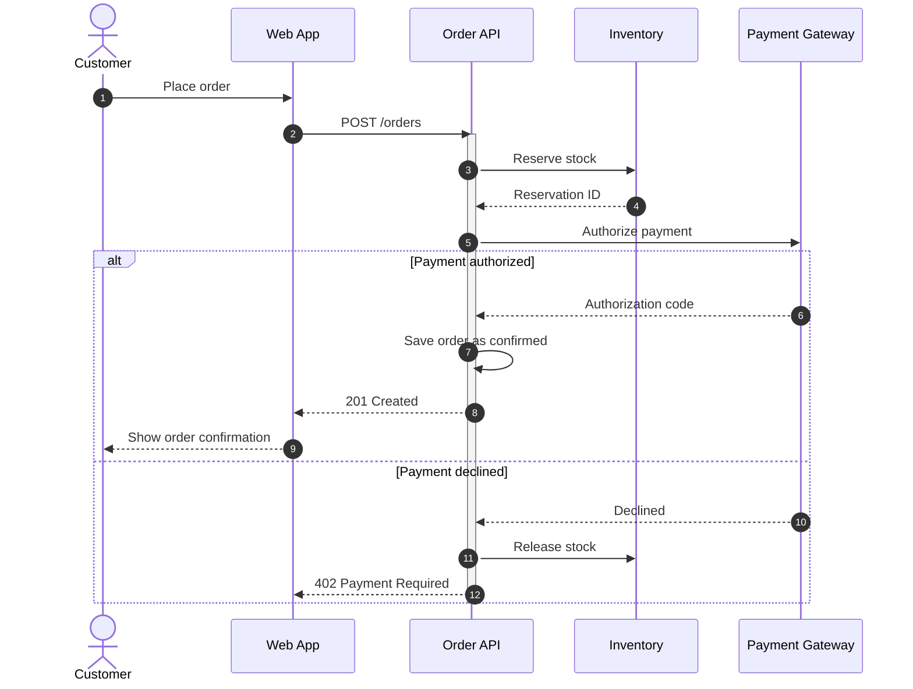
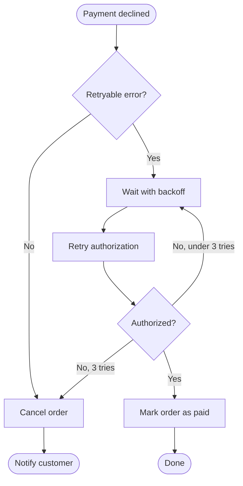
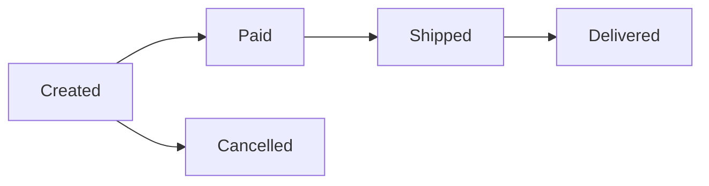
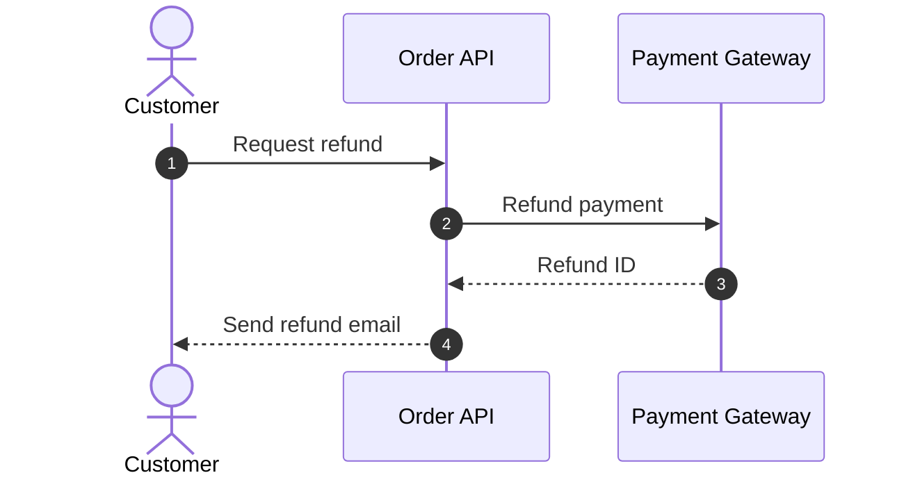

# Checkout Design

> [!NOTE]
> This document describes how an order is placed from the cart page, from the "Place order" button to the order confirmation. Shipping and invoicing are described in separate documents.

## Checkout sequence



### 1. Place order

The customer presses "Place order" on the cart page.

- The button is disabled until the shipping address and payment method are chosen.
- The cart is sent with an idempotency key, so pressing the button twice creates only one order.

### 2. POST /orders

```http
POST /orders HTTP/1.1
Content-Type: application/json
Idempotency-Key: 6f1c2a9e-0b7d-4f3a-9c55-1d2e8a7b4c10
```

```json
{
  "cartId": "c_8241",
  "shippingAddressId": "a_17",
  "paymentMethodId": "pm_card_visa"
}
```

| Status | When |
|---|---|
| 201 | Order confirmed |
| 402 | Payment declined |
| 409 | An item is out of stock |

### 3. Reserve stock

Reserves every item of the cart in one transaction. If one item is short, nothing is reserved and the API returns `409 Conflict`.

```sql
UPDATE stock
SET reserved = reserved + $2
WHERE sku = $1 AND quantity - reserved >= $2;
```

### Reservation ID

The reservation expires after 15 minutes if the order is not confirmed.

### 5. Authorize payment

Authorizes the order total. The amount is captured later, when the order is shipped.

> [!IMPORTANT]
> Never send the card number to the Order API. The Web App sends it to the Payment Gateway directly and passes only `paymentMethodId`.

### Authorization code

Stored with the order and used to capture the payment at shipping.

### Confirm order

Saves the order with the status `confirmed` and links the reservation to it.

```typescript
export async function confirmOrder(tx: Tx, order: NewOrder, auth: Authorization): Promise<Order> {
  const saved = await tx.orders.insert({ ...order, status: 'confirmed', authCode: auth.code });
  await tx.reservations.attach(order.reservationId, saved.id);
  return saved;
}
```

### 201 Created

Returns the order ID and the expected delivery date.

### 9. Show order confirmation

Shows the order number and sends a confirmation email.

- [x] Order number and items
- [x] Expected delivery date
- [ ] Link to cancel within 30 minutes

### Declined

The gateway returns a decline code. See [Payment retry flow](#payment-retry-flow) for the codes that are retried.

### Release stock

Releases the reservation at once, so that other customers can buy the items.

### 402 Payment Required

> [!WARNING]
> Do not show the decline code to the customer. Show "Your payment could not be completed." and let them choose another payment method.

<!-- link-headings:end -->

## Payment retry flow



### Payment declined

The flow starts when the gateway declines an authorization that was started by a background job, such as a subscription renewal.

### Retryable error?

| Decline code | Retry |
|---|---|
| `processing_error` | Yes |
| `try_again_later` | Yes |
| `insufficient_funds` | No |
| `card_declined` | No |

### Wait with backoff

Waits 1 minute, 5 minutes, then 30 minutes.

### Retry authorization

Uses the same idempotency key as the first attempt.

### Authorized?

Checks the result of the retried authorization.

### Complete payment

Updates the order status to `paid`.

### Cancel order

Releases the stock and cancels the order.

### Done

The order continues to shipping.

### Notify customer

Sends an email asking the customer to update their payment method.

<!-- link-headings:end -->

## Order status



### Created

The order is saved and waits for payment.

### Paid

The payment was authorized.

### Shipped

The carrier has the parcel. The payment is captured at this point.

### Delivered

The carrier reported the delivery.

### Cancelled

The order was cancelled before shipping. The authorization is voided.

<!-- link-headings:end -->

## Refund (draft)



### Request refund

Refunds can be requested within 30 days of delivery.

### Refund payment

Refunds the captured amount to the original payment method.

### Send refund email

Tells the customer that the refund can take up to 10 days to appear.

### Restock items

Returned items are checked and added back to the stock.

<!-- link-headings:end -->

## Open items

- [ ] Support partial refunds
  - [x] Agree on the rules with the finance team
  - [ ] Add an amount to the refund request
- [ ] Show the reservation timer on the checkout page
- [x] Use idempotency keys for every payment call

> [!TIP]
> To try the checkout locally, start the gateway mock with `docker compose up -d payment-mock` and use the card `4242 4242 4242 4242`.

<details>
<summary>Why reserve stock before authorizing the payment?</summary>

If the payment is authorized first and the stock then runs out, the authorization has to be voided, and some banks show it to the customer for several days.

</details>

> [!CAUTION]
> Never log the authorization code or any part of the card number.
