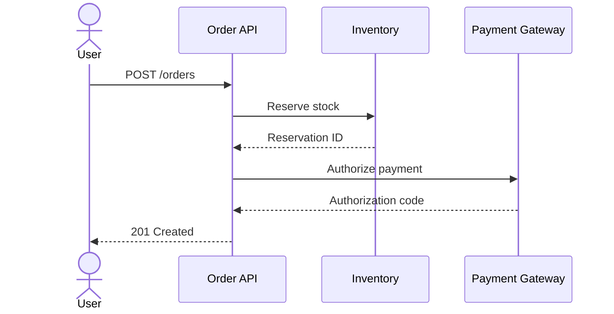

# Order API Error Codes

Long tables keep their header row at the top of the preview while scrolling through them.
The metadata table above has no header row, so nothing stays at the top for it.

## Error codes

| Code | HTTP status | Meaning | Client action |
|---|---|---|---|
| `ORD-001` | 400 | The request body is not valid JSON. | Fix the request. |
| `ORD-002` | 400 | A required field is missing. | Fix the request. |
| `ORD-003` | 400 | `quantity` is not a positive integer. | Fix the request. |
| `ORD-004` | 400 | `sku` does not match the expected format. | Fix the request. |
| `ORD-005` | 400 | Too many items in one order (max 100). | Split the order. |
| `ORD-006` | 400 | The coupon code is malformed. | Ask the user to check the code. |
| `ORD-007` | 401 | The access token is missing. | Log in again. |
| `ORD-008` | 401 | The access token has expired. | Refresh the token. |
| `ORD-009` | 403 | The account is suspended. | Show the support contact. |
| `ORD-010` | 403 | The account cannot order this item. | Hide the item. |
| `ORD-011` | 404 | The item does not exist. | Remove it from the cart. |
| `ORD-012` | 404 | The order does not exist. | Reload the order list. |
| `ORD-013` | 404 | The shipping address does not exist. | Ask for an address again. |
| `ORD-014` | 409 | An item is out of stock. | Show the stock and ask again. |
| `ORD-015` | 409 | The order was already confirmed. | Reload the order. |
| `ORD-016` | 409 | The order was already cancelled. | Reload the order. |
| `ORD-017` | 409 | The cart changed while checking out. | Show the new cart. |
| `ORD-018` | 410 | The coupon has expired. | Remove the coupon. |
| `ORD-019` | 402 | The payment was declined. | Ask for another payment method. |
| `ORD-020` | 402 | The card has expired. | Ask for another card. |
| `ORD-021` | 402 | The 3-D Secure check failed. | Retry the check. |
| `ORD-022` | 422 | The address is outside the delivery area. | Ask for another address. |
| `ORD-023` | 422 | The delivery date is not available. | Show the available dates. |
| `ORD-024` | 422 | The total is below the minimum order. | Show the minimum. |
| `ORD-025` | 429 | Too many requests. | Retry after `Retry-After`. |
| `ORD-026` | 500 | An unexpected error occurred. | Retry later. |
| `ORD-027` | 502 | The payment gateway did not answer. | Retry later. |
| `ORD-028` | 503 | The inventory service is unavailable. | Retry later. |
| `ORD-029` | 503 | The service is under maintenance. | Show the maintenance page. |
| `ORD-030` | 504 | The request timed out. | Check the order list before retrying. |

## Short table

A short table looks the same as before: its header only moves when the table is scrolled past the top.

| Status | When |
|---|---|
| 201 | Order confirmed |
| 402 | Payment declined |
| 409 | An item is out of stock |

## Checkout sequence

In a wide preview, the tables of the steps on the right keep their header at the top too, while the diagram stays on the left.

### POST /orders

Request fields:

| Field | Type | Required | Description |
|---|---|---|---|
| `cartId` | string | Yes | ID of the cart to check out. |
| `addressId` | string | Yes | ID of the shipping address. |
| `deliveryDate` | date | No | Requested delivery date. |
| `deliveryTime` | string | No | Requested time slot (`am`, `pm`, `evening`). |
| `couponCode` | string | No | Coupon to apply. |
| `paymentMethodId` | string | Yes | Token of the payment method. |
| `giftWrap` | boolean | No | Wrap the items as a gift. |
| `giftMessage` | string | No | Message on the gift card (max 200 characters). |
| `note` | string | No | Note to the shop. |
| `idempotencyKey` | string | Yes | Key to make retries safe. |
| `channel` | string | No | `web`, `ios` or `android`. |
| `locale` | string | No | Locale of the confirmation mail. |
| `currency` | string | No | Defaults to the currency of the shop. |
| `points` | integer | No | Loyalty points to use. |
| `referrer` | string | No | Campaign the user came from. |

### Reserve stock

Reserves every item of the cart in one transaction.

### Reservation ID

The reservation expires after 15 minutes if the order is not confirmed.

### Authorize payment

| Gateway result | Order API result |
|---|---|
| `approved` | Continue. |
| `declined` | `ORD-019` |
| `expired_card` | `ORD-020` |
| `authentication_failed` | `ORD-021` |
| `processing_error` | Retry once, then `ORD-027`. |
| `timeout` | Retry once, then `ORD-027`. |

### Authorization code

Stored with the order and used to capture the payment at shipping.

### 201 Created

Returns the order ID and the expected delivery date.

<!-- link-headings:end -->

## In a folded section

Retry policy per error code

| Code | Retry | Wait |
|---|---|---|
| `ORD-025` | Yes | `Retry-After` |
| `ORD-026` | Yes | 1 s, 2 s, 4 s |
| `ORD-027` | Yes | 1 s, 2 s, 4 s |
| `ORD-028` | Yes | 5 s, 10 s, 20 s |
| `ORD-029` | No | — |
| `ORD-030` | No | — |
| `ORD-001` – `ORD-024` | No | — |
| Network error | Yes | 1 s, 2 s, 4 s |
| Unknown | No | — |
| `ORD-014` | No | — |
| `ORD-017` | No | — |
| `ORD-019` | No | — |
| `ORD-021` | Once | — |
| `ORD-022` | No | — |
| `ORD-023` | No | — |

